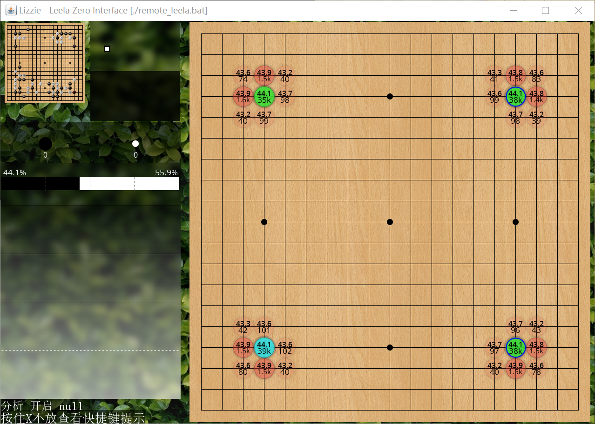

# Leela Zero

## 主要信息

需要自行安装 nvidia-docker 以支持GPU。
如果无法安装，请使用其他人的[纯CPU版本](https://gitlab.com/whendrik/leelazerodocker/blob/master/README.md)。

| 项目 |  值       |
| ------ | ------ |
| 可执行文件 | /leela_zero/src/build/leelaz |
| 权重文件   | /leela_zero/data/best-network.gz|

root用户默认密码为root_for_leelaz，需要自己修改。

## 如何部署

推荐直接使用带有权重的`yao11/leela:with_networ`。
```bash
 docker run -d --name='Leela-zero' \
    -p 32222:22 \
    --runtime=nvidia \
    yao11/leela:with_network
```

## 客户端

### Windows

首先修改好`client/settings.bat`里的内容。

``` bat
set HOST_IP=192.168.1.99
set PORT=32222
set NUM_THREADS=4
```

然后运行：

``` bat
cd client
ssh_copy_id.bat
remote_leela.bat
```

需要注意的是leela第一次运行时会进行tune，需要等待比较长的时间。
测试没有问题后，就可以用GUI程序了。

#### GoGui

`Program`->`New Program`，填写相关信息。

| 项目 |  值       |
| ------ | ------ |
| Command | D:\Tools\leela_z_docker\client\remote_leela.bat |
| Working directory | D:\Tools\leela_z_docker\client\|


然后 `Program`->`Attach Program`，就可以开始使用了。
如果出现了如下警告可以忽略。


#### Lizzie

直接运行lizzie.jar即可。




### Linux

